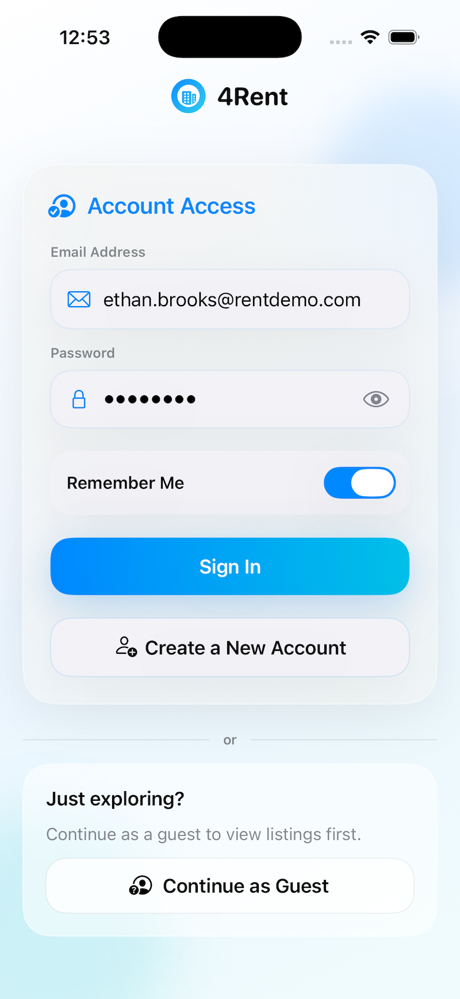
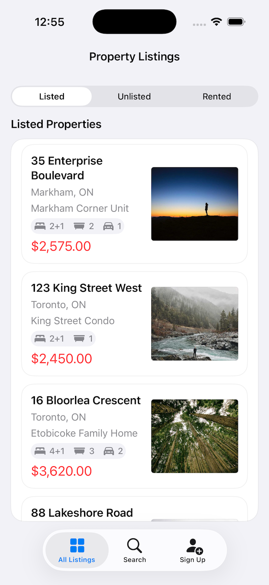
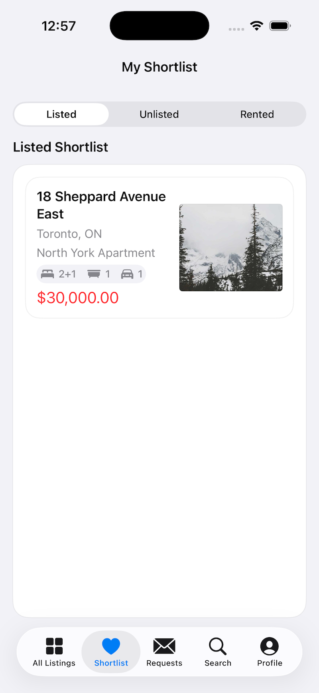
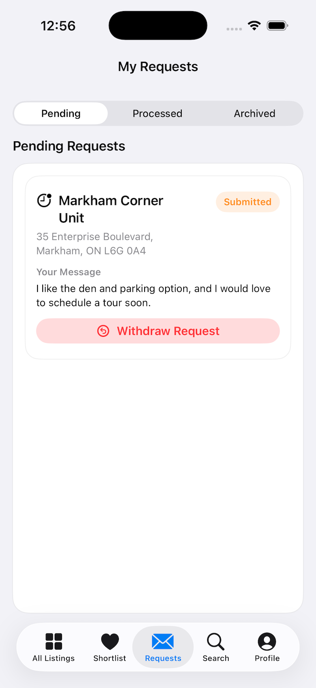
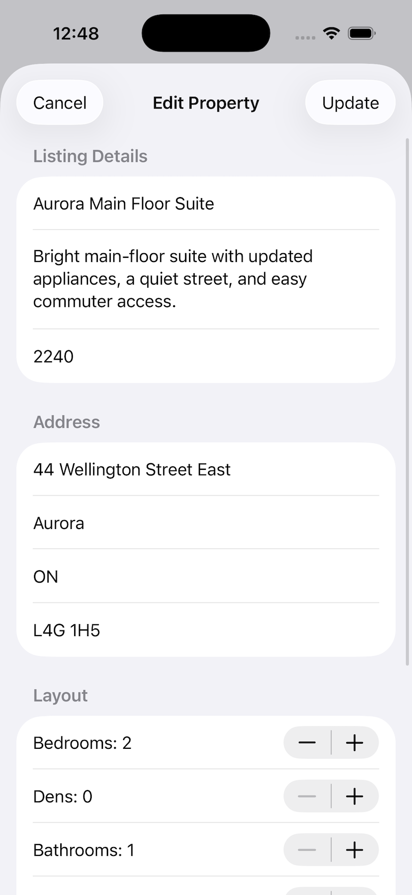
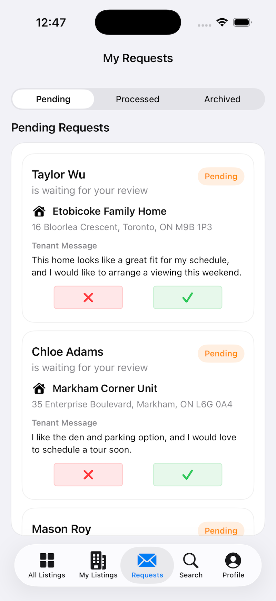

# 4Rent

4Rent is a SwiftUI rental marketplace where guests discover properties, tenants shortlist homes and submit rental requests, and landlords manage listings and review tenant requests through Firebase-backed role-specific workflows.

*Individual Advanced iOS course project designed and implemented by Chuhan Shang.*

## Demo

| Authentication and Role Entry | Guest Property Discovery |
| :---: | :---: |
|  |  |
| Sign in with remembered credentials, create an account, or enter the property marketplace as a guest. | Browse the property catalog by status and inspect key rental details without creating an account. |

| Tenant Shortlist | Tenant Request Tracking |
| :---: | :---: |
|  |  |
| Save properties to a Firestore-backed shortlist and filter them by current listing status. | Track requests by lifecycle status and withdraw an application while it is still pending. |

| Landlord Property Editing | Landlord Request Review |
| :---: | :---: |
|  |  |
| Edit listing details and property status in a single validated form. | Review tenant details and request messages before approving or denying each request. |

## Project Context and Personal Scope

The project brief required a single Firestore-backed rental system with guest, tenant, and landlord experiences, Firebase Authentication, editable profiles, and remembered sign-in credentials.

Within those requirements, the implementation uses one role-aware iOS app, an Observation-based Model-Repository-Store-View structure, Keychain-protected password storage, coordinated request and listing state changes, and reusable SwiftUI result-state components.

## Key Workflows

All roles can browse the property catalog, search available listings, and view property details.

### Guest

- Explore the rental marketplace without creating an account.

### Tenant

- Save properties to a Firestore-backed shortlist, filter saved homes by status, and share property details.
- Submit and withdraw rental requests, prevent duplicate pending requests, and track request history by status.

### Landlord

- Create, edit, list, and unlist owned properties; unlisting automatically withdraws outstanding requests.
- Review tenant requests and profile details, then approve or deny requests for owned properties.

## Technical Highlights

- **Role-driven app composition:** `AppState` represents loading, logged-out, guest, tenant, and landlord sessions. `RootView` uses that state to select a single top-level flow, while `AppSessionCoordinator` centralizes cross-store sign-in, guest access, and sign-out behavior.
- **Separated state and persistence:** `@MainActor` Observation stores expose loading, error, and domain state to SwiftUI. Repository types isolate Firebase Authentication and Firestore operations so views remain focused on presentation and user interaction.
- **Safer remembered credentials:** Remember Me stores the user ID and email in `UserDefaults`, protects the password with the iOS Keychain, and pre-fills the form without automatically submitting a future login.
- **Coordinated listing updates:** When a landlord unlists an available property, a Firestore batch updates the property and withdraws its submitted requests together. The stores then mirror the successful change in local observable state.
- **Workflow validation:** Request actions validate the active role, ownership, and current status before persistence. The tenant flow also queries existing requests to prevent duplicate pending applications.
- **Reusable result states:** Shared loading, empty-state, filter, result-card, and fixed-control layout components keep browse, shortlist, listing, and request screens consistent.

## Architecture

```text
SwiftUI feature views
        |
AppState + @Observable stores
        |
Repository layer
        |
Firebase Authentication + Cloud Firestore
```

- `App/` owns root session state, role routing, and cross-store session coordination.
- `Core/Models/` defines profiles, properties, shortlist entries, and rental requests.
- `Core/Stores/` manages `@MainActor` UI state and validates domain actions.
- `Core/Repositories/` maps models to Firebase Authentication and Firestore operations.
- `Features/` groups authentication, browse, tenant, landlord, profile, and property-detail workflows.
- `Shared/Views/` contains reusable loading, empty, filtering, layout, and result components.

### Firestore Data Model

| Collection | Model | Purpose |
| --- | --- | --- |
| `users` | `UserProfile` | Account role and editable profile details |
| `properties` | `Property` | Rental listing content, ownership, and listing status |
| `rentalRequests` | `RentalRequest` | Tenant-landlord requests and lifecycle status |
| `shortlistProperties` | `ShortlistProperty` | Tenant-to-property shortlist relationships |

## Tech Stack

| Area | Technology |
| --- | --- |
| Language | Swift 5 |
| UI | SwiftUI |
| State management | Observation with `@Observable` |
| Concurrency | Swift `async`/`await` with main-actor stores |
| Authentication | Firebase Authentication |
| Persistence | Cloud Firestore |
| Secure storage | iOS Security framework and Keychain Services |
| Dependency management | Swift Package Manager |

## Running the Project

### Prerequisites

- macOS with Xcode and iOS 26.5 SDK support; the project currently targets iOS 26.5.
- A Firebase iOS project with Email/Password Authentication and Cloud Firestore enabled.

### Configuration

1. Register an iOS app in Firebase with the bundle identifier `shangc.Rent-Project`.
2. Add the Firebase `GoogleService-Info.plist` file at `Rent_Project/GoogleService-Info.plist`.
3. Configure Firebase Authentication and Firestore access rules for the intended users and collections.

Never commit service-account credentials or other private backend secrets.

### Running

1. Open `Rent_Project.xcodeproj` in Xcode.
2. Allow Swift Package Manager to resolve the Firebase dependencies.
3. Select the `Rent_Project` scheme and an iOS simulator or connected device.
4. Build and run the app.

## Planned Improvements

- **Live rental data:** Replace the fictional property records used for the course prototype with an authorized real-estate listing API, allowing users to browse current and verifiable rental inventory.
- **Map-based property discovery:** Add a map view that displays rental properties by location, allowing users to explore listings geographically and open property details directly from the map.

## Author

**Chuhan Shang**

[GitHub](https://github.com/shangc97)
